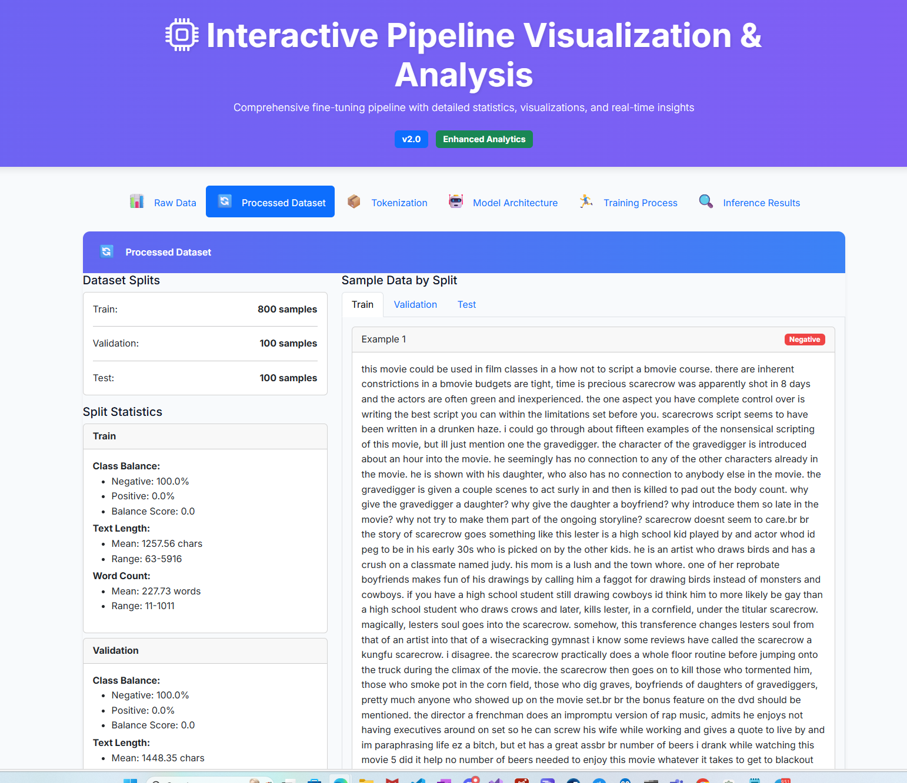
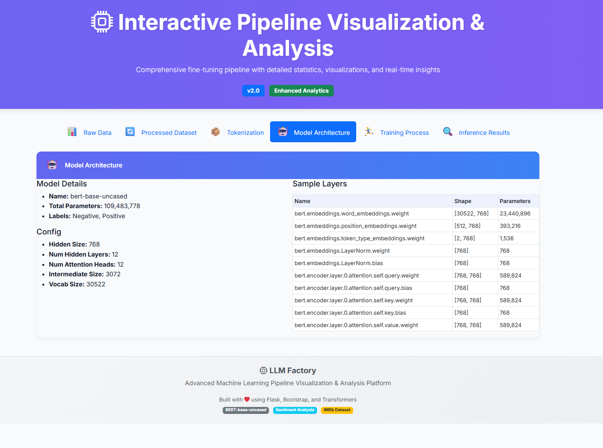
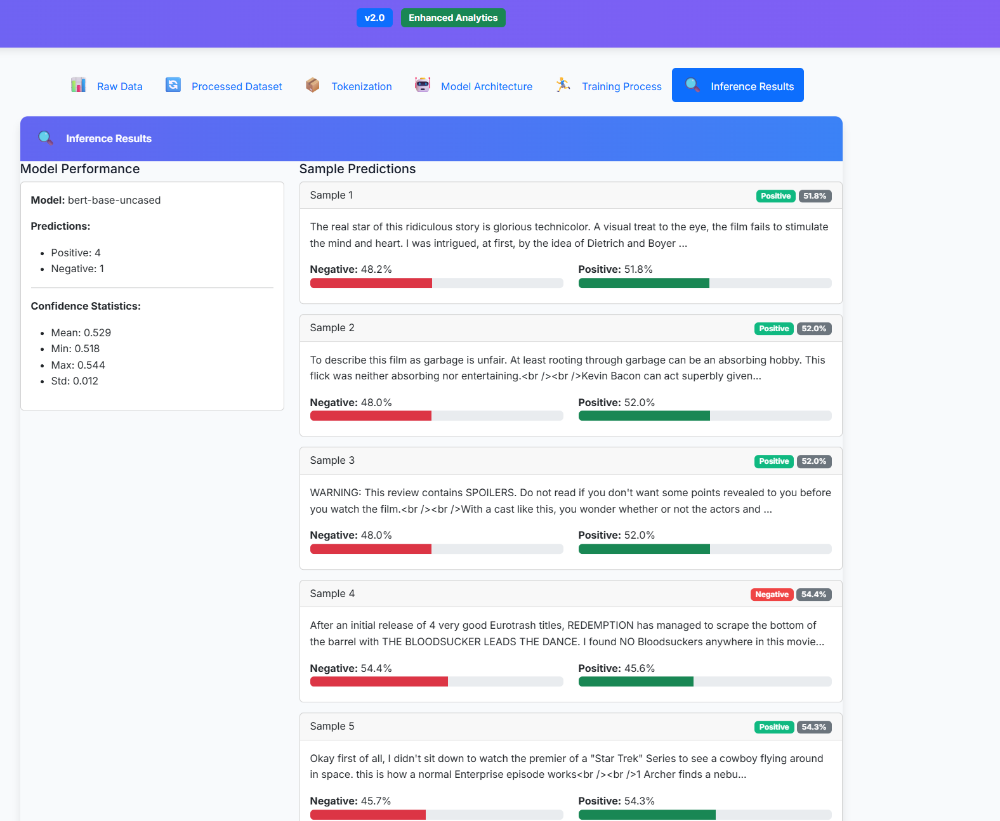

# 🏭 LLM Factory - Interactive Pipeline Visualization & Analysis

[](https://www.python.org/downloads/)
[](https://flask.palletsprojects.com/)
[](https://huggingface.co/transformers/)
[](https://getbootstrap.com/)
[](https://opensource.org/licenses/MIT)
[](https://github.com/YOUR_USERNAME/llm-factory/actions)
[](https://hub.docker.com/)

**LLM Factory** is a comprehensive machine learning pipeline visualization platform that provides detailed insights into every stage of the fine-tuning process, from raw data analysis to model inference.


*Main dashboard showing the complete pipeline visualization*

## 🚀 Quick Start

### 🔧 Automated Setup (Recommended)

Run our setup script for automatic environment configuration:

```bash
# Clone the repository
git clone https://github.com/YOUR_USERNAME/llm-factory.git
cd llm-factory

# Run automated setup
python setup.py
```

This will automatically:
- ✅ Check system requirements
- ✅ Create virtual environment
- ✅ Install dependencies
- ✅ Setup project structure
- ✅ Provide next steps

### 🐳 Docker Setup (Alternative)

For containerized deployment:

```bash
# Clone and build
git clone https://github.com/YOUR_USERNAME/llm-factory.git
cd llm-factory

# Using Docker Compose (recommended)
docker-compose up -d

# Or using Docker directly
docker build -t llm-factory .
docker run -p 5000:5000 llm-factory
```

Access the application at `http://localhost:5000`

## ✨ Features

- 📊 **Interactive Dashboard** - Beautiful web interface for pipeline visualization
- 📈 **Detailed Analytics** - Comprehensive statistics and charts for each pipeline stage
- 🔍 **Data Insights** - Text length analysis, vocabulary statistics, and sentiment distribution
- 🧠 **Model Architecture** - Detailed model configuration and parameter analysis
- 📉 **Training Visualization** - Real-time training loss curves and metrics
- 🎯 **Inference Testing** - Live model testing with confidence scores
- 📱 **Responsive Design** - Works on desktop, tablet, and mobile devices

## 🚀 Quick Start

### Prerequisites

- Python 3.13 or higher
- Git
- 4GB+ RAM recommended
- Windows, macOS, or Linux

### 📦 Installation

#### 1. Clone the Repository

```bash
# Option A: HTTPS (recommended for most users)
git clone https://github.com/YOUR_USERNAME/llm-factory.git
cd llm-factory

# Option B: SSH (if you have SSH keys configured)
git clone git@github.com:YOUR_USERNAME/llm-factory.git
cd llm-factory

# Option C: GitHub Personal Access Token (for private repos)
git clone https://YOUR_TOKEN@github.com/YOUR_USERNAME/llm-factory.git
cd llm-factory
```


*Cloning the repository from GitHub*

> **📝 Note for GitHub Users:**
> - Replace `YOUR_USERNAME` with your actual GitHub username
> - For private repositories, use SSH or personal access tokens
> - Ensure you have proper permissions to clone the repository

#### 2. Create Virtual Environment

```bash
# Windows (PowerShell)
python -m venv llm-factory-env
llm-factory-env\Scripts\activate

# Windows (Command Prompt)
python -m venv llm-factory-env
llm-factory-env\Scripts\activate.bat

# macOS/Linux
python3 -m venv llm-factory-env
source llm-factory-env/bin/activate

# Verify activation (should show virtual env path)
python -c "import sys; print(sys.prefix)"
```


*Creating and activating virtual environment*

> **💡 GitHub Actions Integration:**
> ```yaml
> # Add to your .github/workflows/ci.yml for automated testing
> name: CI
> on: [push, pull_request]
> jobs:
>   test:
>     runs-on: ubuntu-latest
>     steps:
>     - uses: actions/checkout@v4
>     - uses: actions/setup-python@v4
>       with:
>         python-version: '3.13'
>     - run: |
>         python -m venv venv
>         source venv/bin/activate
>         pip install -r requirements.txt
>         python run_simple_finetuning.py
> ```

#### 3. Install Dependencies

```bash
# Upgrade pip first (recommended)
python -m pip install --upgrade pip

# Install all required packages
pip install -r requirements.txt

# For development (optional)
pip install -r requirements-dev.txt  # if available

# Verify installation
python -c "import torch, transformers, flask, matplotlib; print('✅ All key packages installed!')"
```


*Installing Python dependencies*

> **🔧 GitHub Packages:**
> If using GitHub Packages registry, you can also install from there:
> ```bash
> pip install --extra-index-url https://pypi.pkg.github.com/USERNAME/ package-name
> ```

#### 4. Verify GitHub Setup

```bash
# Check Git configuration
git config --list | grep user
git remote -v

# Test GitHub connectivity
git ls-remote origin

# Set up GitHub credentials (if needed)
git config --global user.name "Your Name"
git config --global user.email "your.email@example.com"
```

### 🐙 GitHub Users - Quick Start Guide

For GitHub users, follow these additional steps for optimal setup:

#### GitHub-Specific Features

1. **🔐 Personal Access Token Setup** (for private repos)
   ```bash
   # Create a personal access token at: https://github.com/settings/tokens
   # Scope: repo, read:user
   git clone https://YOUR_TOKEN@github.com/username/llm-factory.git
   ```

2. **🚀 GitHub Actions Integration**
   - The project includes workflow templates in `.github/workflows/`
   - Supports automated testing and deployment
   - Compatible with GitHub-hosted runners

3. **📦 GitHub Container Registry**
   ```bash
   # Build Docker image (optional)
   docker build -t ghcr.io/username/llm-factory .
   docker push ghcr.io/username/llm-factory
   ```

4. **📝 GitHub Issues & PR Integration**
   - Use GitHub Issues for bug reports and feature requests
   - Pull Requests welcome for contributions
   - GitHub Wiki available for extended documentation

#### Troubleshooting GitHub Setup

- **Authentication Issues**: Use GitHub CLI or personal access tokens
- **Large Files**: Consider using Git LFS for model files
- **Actions Failures**: Check Python version compatibility in workflows

> **💡 Pro Tip:** See the complete GitHub setup guide at [`docs/GITHUB_SETUP.md`](docs/GITHUB_SETUP.md)
> 
> **📋 Quick Reference:** Use the GitHub checklist at [`docs/GITHUB_CHECKLIST.md`](docs/GITHUB_CHECKLIST.md)

### 🎮 Running the Application

#### 1. Generate Pipeline Data

```bash
# Run the enhanced pipeline to generate detailed analytics
python run_simple_finetuning.py
```


*Pipeline execution showing detailed statistics generation*

#### 2. Start the Web Application

```bash
# Launch the Flask web interface
python app.py
```

You should see output like:
```
* Serving Flask app 'app'
* Debug mode: on
* Running on http://127.0.0.1:5000
```

#### 3. Access the Dashboard

Open your web browser and navigate to: **http://127.0.0.1:5000**


*Complete interface showing all pipeline stages*

## 📋 Pipeline Stages

### 1. 📊 Raw Data Analysis
- **Dataset Overview** - Sample data table and statistics
- **Text Length Analysis** - Character and word count distributions
- **Vocabulary Analysis** - Unique words, frequency analysis, most common words
- **Sentiment Distribution** - Class balance and sentiment-based text length comparison


### 2. 🔄 Processed Dataset
- **Split Statistics** - Train/validation/test size and distributions
- **Length Comparisons** - Text/word length analysis per split
- **Class Balance** - Sentiment distribution across splits
- **Sample Data** - Examples from each data split



### 3. 📦 Tokenization
- **Token Analysis** - Token length statistics and distributions
- **Special Tokens** - Analysis of BERT special tokens (CLS, SEP, PAD, etc.)
- **Token Types** - Breakdown of complete words vs subwords
- **Cross-Split Comparison** - Token length comparison across data splits


### 4. 🤖 Model Architecture
- **Configuration Details** - Hidden size, layers, attention heads
- **Parameter Breakdown** - Total parameters and layer-wise analysis
- **Model Summary** - Complete BERT configuration



### 5. 🏃‍♂️ Training Process
- **Loss Visualization** - Training and evaluation loss curves
- **Metrics Analysis** - Loss reduction, convergence rate, improvement
- **Training Configuration** - Batch size, learning rate, epochs


### 6. 🔍 Inference Results
- **Live Testing** - Real-time sentiment prediction
- **Confidence Analysis** - Prediction confidence statistics and distribution
- **Model Performance** - Sample predictions with probability scores



### 📊 Screenshots & Visual Guide

All screenshots are stored in [`docs/screenshots/`](docs/screenshots/) directory. To generate your own:

1. **Pipeline Screenshots**
   ```bash
   # Run pipeline and capture terminal output
   python run_simple_finetuning.py > pipeline_output.log 2>&1
   ```

2. **Web Interface Screenshots**
   ```bash
   # Start the application
   python app.py
   # Navigate to http://127.0.0.1:5000
   # Take screenshots of each section
   ```

3. **GitHub Integration Screenshots**
   - Clone process from GitHub
   - GitHub Actions workflow execution
   - Container registry usage

#### Screenshot Checklist for GitHub Users

- [ ] `github-clone.png` - Git clone from GitHub
- [ ] `venv-setup.png` - Virtual environment creation
- [ ] `package-installation.png` - Pip install process
- [ ] `pipeline-execution.png` - Pipeline running in terminal
- [ ] `dashboard-main.png` - Main web interface
- [ ] `raw-data-analysis.png` - Data analysis section
- [ ] `processed-dataset.png` - Dataset processing view
- [ ] `tokenization.png` - Tokenization analysis
- [ ] `model-architecture.png` - Model configuration
- [ ] `training-process.png` - Training visualization
- [ ] `inference-results.png` - Live prediction interface

> **📸 Screenshot Guide:** Follow the detailed instructions in [`docs/SCREENSHOT_GUIDE.md`](docs/SCREENSHOT_GUIDE.md)

## 🛠️ Project Structure

```
LLM Factory/
├── 📁 data/                     # Data storage
│   ├── raw/                     # Original datasets
│   │   └── imdb_sample.csv      # Sample IMDB movie reviews
│   └── processed/               # Processed datasets
│       ├── final_dataset/       # Train/validation/test splits
│       └── tokenized_dataset/   # Tokenized data
├── 📁 models/                   # Model storage
│   ├── tokenizers/              # Cached tokenizers
│   └── trained/                 # Fine-tuned models
├── 📁 src/                      # Source code
│   ├── data_preparation.py      # Data preprocessing
│   ├── tokenization.py          # Text tokenization
│   ├── model_training.py        # Base model training
│   ├── fine_tuning.py           # Model fine-tuning
│   └── distillation.py          # Knowledge distillation
├── 📁 static/                   # Web assets
│   ├── css/styles.css           # Custom styling
│   └── js/main.js               # JavaScript functionality
├── 📁 templates/                # HTML templates
│   └── index.html               # Main dashboard template
├── 📁 notebooks/                # Jupyter notebooks
│   └── complete_pipeline.ipynb  # Interactive exploration
├── 📄 app.py                    # Flask web application
├── 📄 run_simple_finetuning.py  # Enhanced pipeline script
├── 📄 requirements.txt          # Python dependencies
└── 📄 README.md                 # This file
```

## 🔧 Configuration

### Environment Variables

Create a `.env` file for custom configuration:

```bash
# Flask Configuration
FLASK_ENV=development
FLASK_DEBUG=True
FLASK_PORT=5000

# Model Configuration
MODEL_NAME=bert-base-uncased
MAX_LENGTH=128
BATCH_SIZE=4

# Data Configuration
DATA_PATH=data/raw/imdb_sample.csv
OUTPUT_PATH=models/trained/
```

### Custom Dataset

To use your own dataset, ensure it has the following structure:

```csv
text,label
"Your text here...",0
"Another text...",1
```

- `text`: Your input text
- `label`: Binary classification labels (0 for negative, 1 for positive)

## 📊 Requirements

```
flask>=2.3.0
torch>=2.0.0
transformers>=4.52.0
datasets>=2.14.0
pandas>=2.0.0
numpy>=1.24.0
matplotlib>=3.7.0
seaborn>=0.12.0
scikit-learn>=1.3.0
```

## 🐛 Troubleshooting

### Common Issues

#### 1. Matplotlib Threading Error
```bash
RuntimeError: main thread is not in main loop
```
**Solution**: The app uses `matplotlib.use('Agg')` backend. If you still see this error, restart the application.

#### 2. CUDA Out of Memory
```bash
RuntimeError: CUDA out of memory
```
**Solution**: Reduce batch size in training configuration or use CPU-only mode.

#### 3. Missing Data Files
```bash
FileNotFoundError: data/raw/imdb_sample.csv
```
**Solution**: Ensure sample data exists or run data preparation scripts first.

### GitHub-Specific Issues

#### 4. GitHub Clone Authentication
```bash
fatal: Authentication failed for 'https://github.com/...'
```
**Solutions**:
- Use personal access token: `git clone https://TOKEN@github.com/user/repo.git`
- Set up SSH keys: `ssh-keygen -t ed25519 -C "your.email@example.com"`
- Use GitHub CLI: `gh auth login`

#### 5. GitHub Actions Workflow Failures
```bash
Job failed: exit code 1
```
**Solutions**:
- Check Python version in workflow: `python-version: '3.13'`
- Verify requirements.txt compatibility
- Use setup-python action: `actions/setup-python@v4`
- Cache dependencies:
  ```yaml
  - uses: actions/cache@v3
    with:
      path: ~/.cache/pip
      key: ${{ runner.os }}-pip-${{ hashFiles('**/requirements.txt') }}
  ```

#### 6. Large File Issues (Git LFS)
```bash
error: File too large
```
**Solutions**:
- Install Git LFS: `git lfs install`
- Track large files: `git lfs track "*.bin" "*.safetensors"`
- Configure GitHub LFS storage

#### 7. Private Repository Access
```bash
Permission denied (publickey)
```
**Solutions**:
- Add SSH key to GitHub profile
- Use deploy keys for specific repositories
- Configure GitHub Apps for organization access

### GitHub Integration Tips

- **Container Registry**: Use `ghcr.io/username/project`
- **Packages**: Publish Python packages to GitHub Packages
- **Pages**: Deploy documentation with GitHub Pages
- **Security**: Enable Dependabot and CodeQL scanning

> **🔧 More Help:** Check [`docs/GITHUB_SETUP.md`](docs/GITHUB_SETUP.md) for detailed GitHub configuration

### Performance Optimization

- **Memory Usage**: Reduce batch size if running out of memory
- **CPU vs GPU**: The app automatically detects and uses available hardware
- **Chart Generation**: Large datasets may take longer to generate visualizations

## 🤝 Contributing

1. Fork the repository on GitHub
2. Create a feature branch (`git checkout -b feature/amazing-feature`)
3. Commit your changes (`git commit -m 'Add amazing feature'`)
4. Push to the branch (`git push origin feature/amazing-feature`)
5. Open a Pull Request

## 📄 License

This project is licensed under the MIT License - see the [LICENSE](LICENSE) file for details.

## 🙏 Acknowledgments

- **Hugging Face** - For the amazing Transformers library
- **Bootstrap** - For the beautiful UI components
- **Flask** - For the lightweight web framework
- **IMDB Dataset** - For movie review sentiment data

## 📞 Support

### GitHub Support Channels

- **🐛 Issues**: [GitHub Issues](https://github.com/your-username/llm-factory/issues)
- **💬 Discussions**: [GitHub Discussions](https://github.com/your-username/llm-factory/discussions)
- **📚 Documentation**: [GitHub Wiki](https://github.com/your-username/llm-factory/wiki)
- **🔄 Pull Requests**: [Contribute via PR](https://github.com/your-username/llm-factory/pulls)

### GitHub Features

- **📊 Insights**: Track project metrics and contributors
- **🚀 Actions**: Automated testing and deployment
- **📦 Packages**: Host Python packages and Docker images
- **🛡️ Security**: Dependabot alerts and CodeQL scanning
- **📄 Pages**: Host documentation and demos

### Quick Links

- **📋 Project Board**: [GitHub Projects](https://github.com/your-username/llm-factory/projects)
- **📈 Actions Status**: [Workflow Runs](https://github.com/your-username/llm-factory/actions)
- **🏷️ Releases**: [Release Tags](https://github.com/your-username/llm-factory/releases)
- **📊 Repository**: [Commit History](https://github.com/your-username/llm-factory/commits/main)

> **💡 GitHub Pro Tip**: Use GitHub's integrated DevOps features for the complete ML pipeline lifecycle!

---

<div align="center">

**🏭 LLM Factory v2.0** - Built with ❤️ for the ML Community

[🌟 Star this project](https://github.com/your-username/llm-factory) • [🐛 Report Bug](https://github.com/your-username/llm-factory/issues) • [✨ Request Feature](https://github.com/your-username/llm-factory/issues)

</div>
